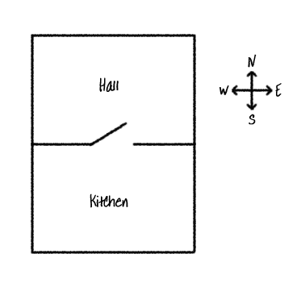

<h2 class="c-project-heading--task">Go the wrong way</h2>

The game is set in a house, type commands to move around the rooms.

<h2 class="c-project-heading--explainer">Here’s what the house looks like to start with:</h2>



### Now run your code

### Step 1

Type a direction you can't go, such as `go west` from the Hall.

When you type the wrong direction, the error message reminds you where you are plus any items in your inventory.


<div class="c-project-output">
```
go west
You can't go that way!
---------------------------
You are in the Hall
Inventory : []
---------------------------
> 
```
</div>

> ### Tip
>
> Experiment with other directions. Type `go south` to move from the Hall to the Kitchen, and then `go north` to go back to the Hall again
{: .c-project-callout .c-project-callout--tip}


~~~~

## Main title


​​### Step 1
Title for each instruction if more than one instrution on a page


Adding code inline using `print()`{:.language-python}. 


--- code ---
---
language: python
filename: main.py
line_numbers: true
line_number_start: 10
line_highlights: 11
---

Put code here

--- /code ---


### Now run your code
This is what you should see when you run your code.


<div class="c-project-output">
```
WHAT THEY SHOULD SEE IF OUTPUT IS TEXT - OTHERWISE USE IMAGE
```
</div>


> ### Tip
> 
> TIPS HERE
{: .c-project-callout .c-project-callout--tip}


> ### Debugging
> 
> DEBUG HERE
{: .c-project-callout .c-project-callout--debug}


> ### Tip / OR / Debugging
> 
> BULLET POINT DEBUG or TIP POINTS HERE
>
> BULLET POINT DEBUG or TIP POINTS HERE
{: .c-project-callout .c-project-callout--tip}
