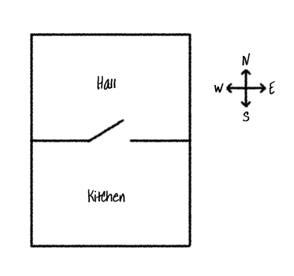

## Go the wrong way

The game is set in a house. Type commands to move around the house.

> [!INFO]
>
> Here's what the house looks like to start with:
>
> 

## Step 1

Type a direction you can't go, such as `go west` from the hall.

When you type the wrong direction, the error message reminds you where you are plus any items in your inventory.

```
go west
You cannot go that way!
---------------------------
You are in the Hall
Inventory : []
---------------------------
>
```

## Step 2

Experiment with other directions. Type `go south` to move from the hall to the kitchen, and then `go north` to go back to the hall again.

## Now run your code

Try typing a direction that does not work, then move south to the kitchen and north back to the hall.
