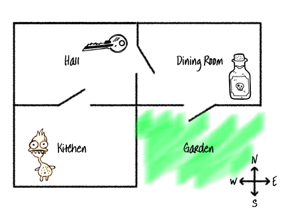

## Add a garden

Add a garden to the south of the dining room. 

Here’s the final map of the game.

Add a **potion** in the Dining room, and a **garden**  to the south. 

--- code ---
---
language: python
filename: main.py
line_numbers: true
line_number_start: 3
line_highlights: 16-20
---
# A dictionary linking a room to other rooms
rooms = {
    'Hall' : {
        'south' : 'Kitchen',
        'east' : 'Dining Room',
        'item' : 'key'
    },
    'Kitchen' : {
        'north' : 'Hall',
        'item' : 'monster',
    },
    'Dining Room' : {
        'west' : 'Hall',
        'south' : 'Garden',
        'item' : 'potion'
    },
    'Garden' : {
        'north' : 'Dining Room'
    }
}
--- /code ---

### Now run your code
Navigate to the `'Garden'`{:.language-python} to test it out.

> ### Tip
> 
> Going into the garden does not make you win the game yet. The winning gameplay still needs to be added.
{: .c-project-callout .c-project-callout--tip}
