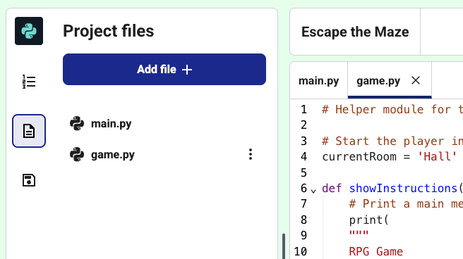

## Winning the game

Make it so player wins by getting to the garden with the key and the magic potion.

### Step 1
More game play is in the `game.py`{:.language-python} file. Open this by clicking on the file tab.



### Step 2
Add the code below to `game.py`{:.language-python} so that the player wins when they get to the **garden** with the **key** and the **potion**. 

--- code ---
---
language: python
filename: game.py
line_numbers: true
line_number_start: 74
line_highlights: 75-77
---
    # add more game play here
    if currentRoom == 'Garden' and 'key' in inventory and 'potion' in inventory:
        print('You escaped the house... YOU WIN!')
        break


    return currentRoom, inventory
--- /code ---

### Now run your code
Test your game to make sure the player can win!


<div class="c-project-output">
```
Monster Game
========
Commands:
go [direction]
get [item]

---------------------------
You are in the Hall
Inventory : []
You see a key
---------------------------
>
go west
You cannot go that way!
---------------------------
You are in the Hall
Inventory : []
You see a key
---------------------------
>
get key
You picked up the key
---------------------------
You are in the Hall
Inventory : ['key']
---------------------------
>
```
</div>


> ### Debugging
> 
> Make sure the code is indented, in line with the code above it. 
{: .c-project-callout .c-project-callout--debug}