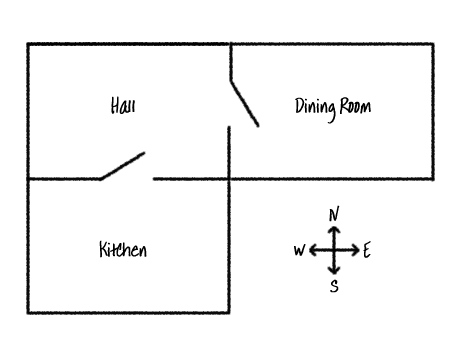

<h2 class="c-project-heading--task">Add a new room</h2>

Add rooms.

<h2 class="c-project-heading--explainer">Follow these instructions</h2>

Use code to put a Dining Room east of the hall.

Each room on the map can be coded as a **dictionary**, and rooms are linked together using directions.

Add the code below to make a new room, and link it to the Hall.

--- code ---
---
language: python
filename: main.py
line_numbers: true
line_number_start: 1
line_highlights: 6-7, 11-13
---
# A dictionary linking a room to other rooms
rooms = {
    'Hall' : {
        'south' : 'Kitchen',
        'east' : 'Dining Room'
    },
    'Kitchen' : {
        'north' : 'Hall'
    },
    'Dining Room' : {
        'west' : 'Hall'
    }
}
--- /code ---

### Debugging

+ Don't forget to add a comma after 'kitchen' when you add a new direction.
+ Make sure you have "closed" the dictionary using curly brackets.

## Now run your code

Type `go east`{:.language-python} from the Hall to move into to the Dining Room, and `go west`{:.language-python} to move back to the Hall.
