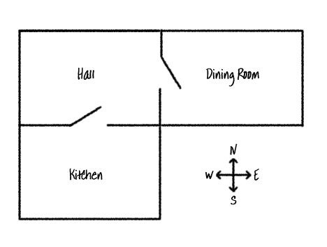

## Add a new room

Add rooms.

Use code to put a dining room east of the hall.

Each room on the map can be coded as a **dictionary**, and rooms are linked together using directions.



Add the code below to make a new room, and link it to the hall.

```python filename="main.py" line_numbers="true" line_number_start="1" line_highlights="6-7,11-13"
# A dictionary linking a room to other rooms
rooms = {
    'Hall' : {
        'south' : 'Kitchen',
        'east' : 'Dining Room'
    },
    'Kitchen' : {
        'north' : 'Hall'
    },
    'Dining Room' : {
        'west' : 'Hall'
    }
}
```

> [!DEBUG]
>
> + Don't forget to add a comma after 'kitchen' when you add a new direction
> + Make sure you have "closed" the dictionary using curly brackets

## Now run your code

Type `go east`{:.language-python} from the hall to move into the dining room, and `go west`{:.language-python} to move back to the hall.
